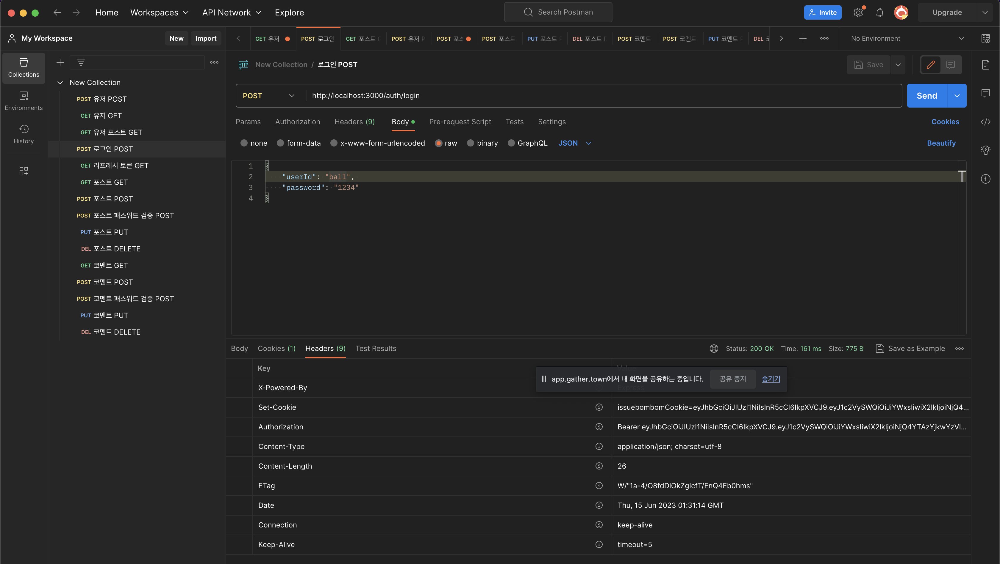

# nodejs_personal_project

## 개요

위 프로젝트를 통해 서버용 데이터베이스 환경 구축하고, 이를 토대로 게시글과 관련해서 CRUD API를 간단하게 구현합니다.

## 최종 결과 명세

### Directory Structure


### API Test with POSTMAN



#### 포스트맨 API 체크 Flow

| 경로                               | API Method | verify token | Description                   | Check List                                                                |
| ---------------------------------- | ---------- | ------------ | ----------------------------- | ------------------------------------------------------------------------- |
| /user                              | POST       | false        | 회원가입                      | 가입 후 유저 조회를 통해 추가 확인, createdAt/updatedAt 체크              |
| /user                              | GET        | false        | 전체유저조회                  | 스키마 디폴트값 적용 유무 체크                                            |
| /auth/login                        | POST       | false        | 로그인                        | 토큰(Access, Refresh) 발행 유무 확인                                      |
| /posts                             | POST       | true         | 포스트 작성(회원전용)         | 포스트 생성 유무 체크, 유저 정보 내 포스트id 내역 추가                    |
| /posts                             | GET        | false        | 전체 포스트 조회              | 스키마 디폴트값 적용 유무 체크                                            |
| /posts/:postId                     | PUT        | true         | 포스트 수정(회원전용)         | 포스트id 존재 유무 체크, 수정 적용 유무 체크, UpdatedAt 체크              |
| /posts/:postId                     | DELETE     | true         | 포스트 삭제(회원전용)         | 삭제 적용 유무 체크, 유저 정보 내 작성한 포스트번호 내역 삭제 체크        |
| /posts/:postId/comments            | POST       | true         | 포스트 내 댓글 작성(회원전용) | 댓글 생성 유무 체크, 포스트 데이터와 유저 데이터 내 댓글id 내역 추가      |
| /posts/:postId/comments            | GET        | false        | 포스트 내 댓글 조회           | 스키마 디폴트값 적용 유무 체크                                            |
| /posts/:postId/comments/:commentId | PUT        | true         | 댓글 수정(회원전용)           | 댓글, 포스트id 존재 유무 체크, 수정 적용 유무 체크, UpdatedAt 체크        |
| /posts/:postId/comments/:commentId | DELETE     | true         | 댓글 삭제(회원전용)           | 삭제 적용 유무 체크, 유저와 포스트 정보 내 작성한 댓글번호 내역 삭제 체크 |

[상세 API 명세보기](https://ionized-aster-f0c.notion.site/9343a74969704533820ab42c10daa3c9?pvs=4)

## Lv.2 (2주차) 진행사항

> 📌 `TO DO LIST`
>
> - [x] 회원가입 시 passwordConfirm 검증 추가 구현
> - [ ] Access 재구현(쿠키 전달 방식으로 변경)
> - [ ] swagger를 이용하여 API 스펙 관리

### 개인 프로젝트 Lv.2 상세 업데이트 내역

23.06.12 주차에 완성한 프로젝트에서 추가 및 수정된 내용입니다.

> 📌 `AWS에 제출된 1주차 과제 코드에는 적용되어 있지 않습니다.`

- password와 passwordConfirm 검증 기능
- 게시글 수정, 삭제 전 등록된 패스워드 검증 API를 미들웨어로 변경 및 적용
- 댓글 수정, 삭제 전 등록된 패스워드 검증 API를 미들웨어로 변경 및 적용

## Lv.1 (1주차) 진행 사항

### MongoDB 생성 및 mongoose 다루기

내 PC를 mongoDB 데이터베이스 관리를 위한 서버로서 활용하기 위해 아래 내역을 설치한다.

```zsh
# brew에서 mongodb-community 설치
brew tap mongodb/brew
brew install mongodb-community
```

설치가 완료되면 mongodb를 실행한다.

```zsh
brew services start mongodb-community

# 종료는 stop
# brew services start mongodb-community
```

위 과정이 끝나면 npm 패키지로 mongoose도 설치해 준다.

```zsh
npm install mongoose
```

### 디렉토리 Path 설정

초기에는 `schemas`와 `routes` 폴더를 생성하여 task를 분류한다. `schemas`의 경우 mongoDB connection과 schema를 관리하고, `routes`는 API method에 따른 req, res 명령을 관리한다.

추후에는 MVC 패턴을 적용하여 route에서 controllers로 확장할 수 있다.

### mongoDB Connect

```javascript
// ./schemas/index.js
const mongoose = require('mongoose');

const connect = () => {
  mongoose
    .connect('mongodb://localhost:27017/myDatabase') // 자동으로 데이터 베이스 신규 생성 됨을 확인
    .catch((err) => console.log(err));
};

mongoose.connection.on('connected', () => {
  console.log('mongoDB connected');
});

mongoose.connection.on('error', (err) => {
  console.error('connection error', err);
});

module.exports = connect;
```

강의에서는 위 코드를 제공하며 복붙하고 쓸 것을 요청한다. 하지만 이 코드만 던져주면 여러 의문점이 생겨서 몇가지 확인했다.

1. 설치 이후 데이터베이스 생성을 한 적이 없는데 myDatabase로 어떻게 접근이 가능한 건가?
   -> mongoDB에 접속 시 myDatabase란에 입력된 값이 데이터 리스트 목록에 없다면 신규 생성하고, 있다면 기존 데이터베이스를 자동으로 가져온다. 이는 터미널에서 `mongosh` 명령을 통해 확인할 수 있었다. mongosh에 들어가면 mongodb를 위한 shell이 활성화 되는데 이 곳에서 `show databases`를 입력하면 지금까지 생성된 데이터베이스를 확인할 수 있다. 위 코드에서 connect 함수가 실행되는 순간 생성된 것이다.
2. `mongoose.connection.on`은 뭐하는 메서드인가?  
   -> mongoDB 커넥션 상태에 대한 이벤트 리스너였다. `error` 데이터베이스의 연결 에러 발생에 대한 이벤트 리스너였다. error 말고도 connected, disconnected, close 등 몇몇 더 있다. 해당 이벤트리스너는 해당 코드가 기록된 js 파일이 require되는 순간 실행되므로 사전에 이벤트가 등록된다. 그러므로 로깅을 위한 용도로 활용할 수 있겠다.
3. 어차피 이벤트리스너로 connection error에 대한 경고 코드가 작성되어 있는데 왜 굳이 connect 함수에서 catch를 사용하여 에러에 대한 처리를 하는가? 이렇게 되면 이중 처리가 아닌가?  
   -> 맨 처음 데이터베이스 연결할 때 커넥션에 문제가 있는지 파악하는 것과, 네트워크 통신 중 커넥션이 끊겼을 때에 대한 경고를 구분하기 위해서가 아닌가 생각하고 있다. 이 둘은 문제 해결을 위한 접근 방향이 다를 수 있기 때문이다.
4. mongoDB connect는 있는데 왜 disconnect를 설정하지 않는가?  
   -> API 메소드에 대한 처리가 시작되면 connect하고 끝나면 disconnect하는게 마치 쓸 때만 켜고 끄는 것과 같아서 자원을 좀 더 효율적으로 쓰게 되지 않나? 라는 생각에서 비롯된 질문이었다. 이에 대해 좀 더 검토해본 결과 결론적으로 connect를 유지하는 것이 전반적으로 유리하다는 의견이 많았다. 왜냐하면 지속적으로 연결 및 해제를 반복하는 것은 이를 위한 프로세스가 늘 생성한다는 말이기 떄문에 오히려 네트워크 오버헤드를 초래할 수 있다는 의견이다. 물론 예상했던대로 수시로 켜고 끄는 형태는 서버 자원을 좀 더 효율적으로 활용하는 길이 될 수도 있다. 하지만 서비스 과정에서는 네트워크 통신 속도가 유저의 만족도와 직결되므로 컴퓨팅 자원을 늘릴지언정 속도를 잡는 것이 우선이겠다는 생각이 들었다. 추가적으로 장기간 통신이 없을 경우 `유휴 연결`을 유지하는 기능이 mongoDB에 탑재되어 있다고 한다. 일종의 잠자기 모드와 비슷한 개념이므로 해당 기능이 컴퓨팅 자원 이슈에 대한 부분을 커버해준다. 하지만 유휴 상태를 깨우는 시점에는 분명 딜레이가 발생할 것이다. 해당 소요 시간이 어떻냐도 고려해볼 문제인 것 같다.

### 유저의 get post 테스트

```javascript
// server.js
const express = require('express');
const app = express();
const PORT = 3000;

const usersRouter = require('./routes/users.router');

const connect = require('./schemas');
connect();

app.use(express.json());

app.use('/api/users', usersRouter);

app.listen(PORT, () => {
  console.log('Server is listening...', PORT);
});
```

해당 API 프로젝트의 메인은 server.js 파일이 맡는다. 간단히 API 처리를 위한 Flow를 살펴보면 먼저 미들웨어 활용을 통해 `/api/users`에 대한 처리를 usersRouter 변수로 넘겨지는 것을 확인할 수 있다. usersRouter는 `routes` 폴더 내 `users.router.js`파일에 해당하며 이 파일 내에서 express.Router() 메소드 활용을 통해 API method별 기능을 구분하여 구현 및 관리한다.

### mongoDB Schema

수집할 데이터에 대한 메타데이터 등록 즉 정의가 필요하다. 유저 정보를 수집한다면 구체적으로 어떤 타입으로 수집 유형에 대한 정의가 필요하고 이를 mongoDB에서는 스키마라고 부른다.

```javascript
const mongoose = require('mongoose');

const userSchema = new mongoose.Schema({
  userId: {
    type: String,
    required: true,
    trim: true,
  },
  password: {
    type: String,
    required: true,
    trim: true,
  },
  createdAt: {
    type: Date,
    default: Date.now,
  },
  updatedAt: {
    type: Date,
    default: Date.now,
  },
});
module.exports = mongoose.model('User', userSchema);
```

위 스키마에서 정의하지 않은 ObjectId 즉 primary key의 경우 자동 생성된다. 하지만 createdAt과 updatedAt이 자동 생성되지 않는 다는 점이 mySQL과의 차이점이다.

이 파트에서도 한 가지 의문점이 들었는데, 왜 스키마 별로 js 파일을 생성해서 따로 관리하려는 건지 의문이었다. 왜냐하면 models.js를 만들어서 해당 파일 안에 여러 스키마를 정의하여 이를 module.exports할 때 model이라는 객체를 생성해서 한데 담으면 프로젝트가 확장되는 과정에서 schema 파일을 계속 생성하게 될텐데 시각적으로도, 관리 차원에서도 파일이 많을 필요가 없을 것 같다는 생각이 들었기 떄문이다. ( 이부분은 문제가 없다면 향후 반영 예정 )

### 라우터 영역

```javascript
// users.router.js
const express = require('express');
const usersRouter = express.Router();

const User = require('../schemas/user');

// 유저 조회(API 확인용)
usersRouter.get('/', async (req, res) => {
  const getUsers = await User.find({});

  res.send({ users: getUsers });
});

// sign-up
usersRouter.post('/', async (req, res) => {
  const { userId, password } = req.body;

  // 고유값에 대한 검증을 합니다.
  const findUser = await User.find({ userId });
  if (findUser.length !== 0) return res.status(400).send({ msg: '해당 아이디가 이미 존재합니다.' });

  // 계정 생성
  await User.create({ userId, password });
  res.send({ msg: '유저 등록 완료' });
});

module.exports = usersRouter;
```

schema 파일의 마지막 단에서 항상 `module.exports = mongoose.model('User', userSchema);`가 실행되므로 이를 require하면 스키마로 정의한 하나의 모델을 들고 오는 것과 같아진다. 재밌는 점은 (이는 MySQL과도 유사해 보이는데) 모델 생성 시 `User`라고 이름지어서 등록했는데 get, post 등을 요청할 경우 mongoDB에서는 해당 모델을 컬렉션으로 판단하고, 이름을 `users`라는 소문자와 복수형 단어로 변경해서 저장한다는 점이다.  
또한 mongoDB에는 각 필드별 유니크값을 지니도록 하는 설정이 없어 sign-up 단계에서 중복 방지 검증을 진행한다.

## 추가 진행 사항

### 로그인 기능 구현

Access Token 생성을 통해 로그인 유저에 한하여 포스팅 권한을 부여하는 방식을 구현해 보았다.

```javascript
// login.router.js
const express = require('express');
const issuebombomCookie = require('jsonwebtoken');
const User = require('../schemas/user');

const loginRouter = express.Router();

loginRouter.post('/', async (req, res) => {
  const user = req.body;

  // 데이터베이스에서 유저 정보 조회
  const findUser = await User.findOne({ userId: user.userId });
  if (findUser.length == 0) return res.sendStatus(401); // 중복 id

  // 토큰 생성
  const accessToken = issuebombomCookie.sign(user, process.env.ACCESS_TOKEN_KEY, {
    expiresIn: '20s',
  });
  const refreshToken = issuebombomCookie.sign(user, process.env.REFRESH_TOKEN_KEY, {
    expiresIn: '1h',
  });

  // refresh token 등록
  const update = { $set: { refreshToken } };
  await User.updateOne(findUser, update);

  // refresh token 쿠키로 전달
  res.cookie('issuebombomCookie', refreshToken, {
    httpOnly: true,
    maxAge: 24 * 60 * 60 * 1000, // 24 시간
  });

  res.setHeader('Authorization', `Bearer ${accessToken}`);
  res.sendStatus(200);
});

module.exports = loginRouter;
```

로그인을 시도하면 우선 데이터베이스에 해당 정보가 있는지, 즉 회원 여부를 판단한다.  
이후 회원임이 입증되면 유저 정보와 토큰 생성 키를 기반으로 Access Token 생성하여 유저에게 해더 내 Authorization으로 전달해준다.  
이를 통해 회원은 게시글 작성 및 조회 시 auth 기반으로 접근 허용 범위를 결정할 수 있다.

또한 Access Token이 권한 검증에 사용되는 기본적인 토큰이지만 유효 기간을 설정하고, 만기 시 refresh 토큰을 통해 재발급 받는 구조를 구현할 예정이다.  
우선은 초기 로그인 시 refresh token도 함께 발급되며 이는 쿠키, 데이터베이스에 저장한다.

위 예시에는 issuebombomCookie라는 쿠키명에 리프레시 토큰을 담는데 httpOnly 옵션 설정을 통해 자바스크립트 코드로 인한 쿠키 탈취를 방지한다.  
또한 maxAge는 해당 쿠키의 만기 설정에 해당한다.

### Access Token의 재발급

```javascript
// refresh.router.js
const express = require('express');
const jwt = require('jsonwebtoken');
const User = require('../schemas/user');

const refreshRouter = express.Router();

refreshRouter.get('/', async (req, res) => {
  const cookies = req.cookies;
  // 쿠키가 없는 경우
  if (!cookies?.issuebombomCookie) return res.status(403).send({ msg: '찾는 쿠키 없음' });

  // 쿠키가 있으면
  const refreshToken = cookies.issuebombomCookie;
  // DB에 저장된 쿠키가 있는지 확인
  const user = User.findOne({ refreshToken });
  if (user == null) return res.status(403).send({ msg: '등록된 리프레시 토큰이 없음' });
  // 쿠키 검증
  jwt.verify(refreshToken, process.env.REFRESH_TOKEN_KEY, (err, user) => {
    // refresh token이 만료된 경우 재로그인 안내
    if (err) return res.status(403).send({ msg: '리프레시 토큰이 만료됨 (재 로그인 필요)' });

    // 신규 토큰 생성
    const accessToken = jwt.sign(
      { userId: user.userId, password: user.password }, // 현재 user에는 토큰의 iat와 exp가 담겨있어 제외해야 한다.
      process.env.ACCESS_TOKEN_KEY,
      { expiresIn: '1m' }
    );
    // 재발급
    res.setHeader('Authorization', `Bearer ${accessToken}`);
    res.status(200).send({ msg: '토큰 재발급 완료' });
  });
});

module.exports = refreshRouter;
```

리프레시 토큰은 엑세스 토큰의 재발급을 위한 토큰으로 일반적으로 유효 기간이 엑세스토큰보다 길다. 리프레시 토큰까지 만료된다면 재로그인을 해야한다.  
리프레시 토큰은 기본적으로 쿠키에 담도록 설정되었는데 이를 확인하기 위해서는 아래와 같이 cookie-parser가 미들웨어에서 동작해야 한다.

```javascript
const cookieParser = require('cookie-parser');
app.use(cookieParser());
```

위 설정이 없다면 req.cookies는 undefined를 출력하게 된다.  
위 과정에서는 엑세스 토큰이 만료된 시점에서 동작해야할 코드다. 처음에는 찾는 쿠키가 있는지, 그 뒤로는 쿠키에 담긴 리프레시 토큰이 데이터베이스에도 저장되어 있는지 검증한다.  
로그인 시점에 리프레시 토큰을 유저의 데이터베이스에 저장하므로 당연히 리프레시 토큰으로 find할 경우 해당하는 유저 결과가 하나 나와야 한다.  
이와 같은 방식으로 우선적으로 리프레시 토큰을 검증하고, 2단계로 jwt.verify로 검증한다. 이상이 없다면 토큰을 재발급한다.

### 회원 전용 게시글 작성

```javascript
postsRouter.get('/', authMiddleware, async (req, res) => {
  // 유저의 _id를 가져와서 post에 입력해야 한다.
  const { userId, password } = req.user;
  const user = await User.findOne({ userId, password }).populate('posts'); // 해당 유저의 포스트를 가져온다.
  res.send(user.posts);
});

postsRouter.post('/', authMiddleware, async (req, res) => {
  const { userId, password } = req.user;
  const findUser = await User.findOne({ userId, password });
  const { title, postPassword, content } = req.body;
  const createdPost = await Post.create({ title, postPassword, content, user: findUser._id });

  // 유저 정보에 유저가 올린 포스팅 정보를 담는다.
  const update = { $push: { posts: createdPost._id } };
  await User.updateOne({ _id: findUser._id }, update);
  res.json({ msg: '포스팅 완료' });
});

function authMiddleware(req, res, next) {
  // auth에서 access token을 획득합니다.
  const authHeader = req.headers.authorization;
  const token = authHeader && authHeader.split(' ')[1]; // Bearer 제거
  if (token == null) return res.status(401).send({ msg: '엑세스 토큰을 입력해 주세요.' }); // 토큰이 없다면 종료

  // access token 검증
  jwt.verify(token, process.env.ACCESS_TOKEN_KEY, (err, user) => {
    // access token이 만료된 경우 재생성하기
    if (err) return res.status(403).send({ msg: '엑세스 토큰이 만료되었습니다.' });
    req.user = user;
    next();
  });
}
```

authMiddleware를 통해 Post(게시글)를 등록하기 위해서는 로그인 시 발급 받았던 엑세스 토큰의 소유 유무를 확인한다. 즉 가입 회원만이 이용이 가능하도록 설정했다.  
위 코드에서는 `req.headers.authorization`를 통해 헤더의 authorization으로 토큰을 받을 것을 가정하고 있다. 이를 통해 소유 유무 및 유효 기간 만료 검증을 한다.  
검증 이후 포스팅이 가능하도록 구현했지만 프론트의 상황에 따라 바뀔 수 있다. 작성하기 버튼을 클릭하는 단계에서 검증을 완료하면 작성 페이지로 이동하고, 이후 특별한 검증 없이 게시글 작성이 가능하도록 해도 된다.  
또한 게시글 조회에 해당하는 get 메서드에서도 미들웨어를 통한 검증을 거치고 있는데, 이는 자신이 작성한 게시글만 볼 수 있도록 하는 형태를 가정하여 구현했다. 하지만 향후 코멘트 기능을 고려한 API도 구현할 예정이므로 게시글 조회는 공개로 변경될 예정이다.

### mongoDB 스키마의 ref 기능과 populate 메소드

```javascript
const postSchema = new mongoose.Schema({
  title: {
    type: String,
    required: true,
  },
  postPassword: {
    type: String,
    required: true,
    trim: true,
  },
  content: {
    type: String,
    required: true,
  },
  user: {
    type: mongoose.Schema.Types.ObjectId,
    ref: 'User',
  },
});
```

위 모델과 같이 포스팅 데이터 스키마를 정의했다고 가정하자. user 필드에서는 mongoDB에서 사용하는 objectId 타입을 데이터로 받고, User 컬렉션을 참조(ref)한다고 명시되어 있다.  
이와 같이 작성하면 게시글 조회 시 해당 게시글을 작성한 유저의 정보를 연계해서 한꺼번에 받을 수 있게 된다.  
post 메서드로 최초 게시글 업로드 시 user 란에 작성자의 id를 기입하면 된다. 그러면 아래 코드와 같이 게시글 데이터 및 작성자 데이터도 한꺼번에 조회할 수 있게 된다.

```javascript
const post = await Post.findOne({ title }).populate('user');
res.send(post.user); // 해당 포스터를 작성한 유저 정보도 가져올 수 있게 된다.

>>
{
  "_id": "64884455b39c90748b5256eb",
  "username": "ball",
  "password": "1234",
  "role": "user",
  "posts": [
      "6488466045015406a1c93331"
  ],
  "refreshToken": "eyJhbG...",
  "createdAt": "2023-06-13T10:26:29.675Z",
  "updatedAt": "2023-06-13T10:26:29.676Z",
  "__v": 0
}
```

위 코드를 보면 특정 타이틀을 지닌 포스터를 조회했지만 populate 메서드를 통해 작성자의 정보도 한꺼번에 들고 올 수 있게 되었다.

> 🚨 `주의`  
> polulate를 통해 들고온 Post 내 user 데이터에 수정을 시도한다해도 원본인 User 데이터에 반영되지 않음으로 ref로 연결된 데이터의 수정이 필요할 경우 직접 해당 모델을 가져와 수정해야 한다.

### mongoDB의 find 사용 시 주의할 점

#### case 1

```javascript
const user = await User.findOne({ _id });
```

위 코드는 User 컬렉션에서 `_id`의 값을 찾는 명령이다. 만약 `_id` 변수의 값이 컬렉션에 없는 id라면 `null`이 결과로 나온다.

```javascript
const update = { $set: { age: 40 } };
await User.updateOne(user, update);
```

위 코드는 검색한 user에 대해서 나이를 40으로 변경하라는 명령이다. 그런데 만약 user가 `null`이라면 어떻게 될까? 일반적으로는 당연히 조건에 일치하는 유저가 없으니 아무런 변경이 없어야 한다.  
하지만 _User 컬렉션에서 가장 오래된 유저 데이터(다큐먼트)의 나이를 바꿔버린다._

updateOne 메서드가 원치 않는 명령을 수행하는 것이다. 이 부분은 의도한 바와 다르기 때문에 해결하기 위해서는 반드시 null값에 대응하기 위해서는 `if (!user) return res.send( { 'msg': '데이터 없음'})`과 같은 처리를 통해 방지해야 한다.

#### case 2

```javascript
const user = await User.findById({ _id });
```

위 경우는 mongoDB에서 자동으로 생성해주는 ObjectId 조회를 통한 find 메소드에 해당한다. 사실 find와 큰 차이는 없지만 굳이 다른 예시를 가져왔다.  
여기서도 만약 `_id` 변수의 값이 컬렉션에 없는 id라면 `null`이 나온다. 사실 null은 에러가 아니기 때문에 위와 같은 if문 처리를 해주지 않으면 뒤에 가서 큰일날 수가 있다.

```javascript
const age = user.age;
```

위 코드처럼 \_id를 기준으로 user를 찾은 후 해당 유저의 나이를 변수도 받고 있다. _그런데 user가 null이라면?? 위 코드에서는 에러가 발생한다._ `null에서 age 프로퍼티를 찾을 수 없다.`라는 에러와 함께 서버가 정지한다. 그렇기 때문에 이를 방지하기 위해서는 반드시 try, catch문으로 대응을 해줘야 한다.

정리하자면 find의 결과가 null이길 바라지 않는 API 에서는 반드시 에러 비슷한 처리를 해줘야 하며, 이를 놓친다면 null값에 대한 프로퍼티를 요청하는 코드가 동작할 경우 에러가 발생할 것이므로 이를 위한 try, catch도 함께 이용하는 것이 좋다.

### Collection Validator 설정

```javascript
username: {
    type: String,
    required: true,
    match: /^[a-zA-Z0-9]+$/,
    minlength: 5,
    maxlength: 40,
    trim: true,
  },
  password: {
    type: String,
    required: true,
    match: /^[a-zA-Z0-9!@#$%^&*()]+$/,
    minlength: 8,
    maxlength: 20,
    trim: true,
  },
```

각 필드에 대해서 입력 가능한 문자, 글자수 제한, 필수 입력의 조건을 위 코드와 같이 적용하였다.

### 엑세스 토큰 검증과 리프레시 토큰을 활용한 엑세스 토큰 재발급

위 두가지 사항을 미들웨어로 만들었으며, 회원 증명이 필요한 요청에는 이 두가지 미들웨어가 포함된다.  
위에서도 검증 미들웨어에 대해서 소개헀지만 `varification.js` 파일을 생성하여 아래와 같이 수정되었다.

```javascript
// 엑세스 토큰 검증을 위한 미들웨어
function verifyAccessToken(req, res, next) {
  // auth에서 access token을 획득합니다.
  const authHeader = req.headers.authorization;
  const token = authHeader && authHeader.split(' ')[1]; // Bearer 제거
  if (!token) return res.status(401).send({ msg: '엑세스 토큰을 입력해 주세요.' }); // 토큰이 없다면 종료

  // access token 검증
  jwt.verify(token, process.env.ACCESS_TOKEN_KEY, (err, user) => {
    // access token이 만료된 경우 재생성하기
    if (err) {
      req.expired = true;
      console.error(err.name, ':', err.message);
    }
    req.user = user;
    next();
  });
}
```

먼저 엑세스 토큰 발급에 대한 미들웨어이다. 만약 엑세스 토큰이 만료되었거나, 값이 다를 경우 만료된 것으로 인정한다.  
코드에서 보는 것과 같이 verify 메서드의 결과가 err 즉 검증에 실패한다면 request에 true값을 담아 다음 미들웨어에 전달된다.  
그리고 나서 다음 미들웨어에서 req.expired가 true값을 가질 경우 실행되고, 그렇지 않을 경우 생략된다.

```javascript
// 엑세스 토큰 만료 시 재발급을 위한 미들웨어
async function replaceAccessToken(req, res, next) {
  if (req.expired) {
    try {
      const cookies = req.cookies;
      // 쿠키가 없는 경우
      if (!cookies?.issuebombomCookie)
        return res.status(403).send({ msg: '엑세스 토큰 재발급을 위한 쿠키 없음' });

      // 쿠키가 있으면
      const refreshToken = cookies.issuebombomCookie;
      // DB에 저장된 쿠키가 있는지 확인
      const user = await User.findOne({ refreshToken });
      if (!user) return res.status(403).send({ msg: '해당 쿠키에는 등록된 리프레시 토큰이 없음' });
      // 쿠키 검증
      jwt.verify(refreshToken, process.env.REFRESH_TOKEN_KEY, (err, user) => {
        // refresh token이 만료된 경우 재로그인 안내
        if (err) return res.status(403).send({ msg: '리프레시 토큰이 만료됨 (재 로그인 필요)' });

        // 신규 토큰 생성
        const accessToken = jwt.sign(
          { username: user.username, _id: user._id }, // 현재 user에는 토큰의 iat와 exp가 담겨있어 제외해야 한다.
          process.env.ACCESS_TOKEN_KEY,
          { expiresIn: '30m' }
        );
        // 재발급
        res.setHeader('Authorization', `Bearer ${accessToken}`);
        res.status(200).send({ msg: '엑세스 토큰이 만료되어 재발급' });
      });
    } catch (err) {
      console.error(err.name, ':', err.message);
      return res.status(500).send({ msg: `${err.message}` });
    }
  } else {
    next();
  }
}
```

위 과정은 엑세스 토큰 재발급 과정이다. 이전 미들웨어에서 req.expired에 true값을 받는다면 엑세스 토큰이 만료된 것으로 간주하고 재발급을 시도한다.  
이 과정에서 쿠키에 저장된 리프레시 토큰을 요청하여, 쿠키가 없거나, 값이 다를 경우에 대한 대처를 하고, 이후 리프레시 토큰마저 만료되었다면 재 로그인 요청 메시지를 남기고 종료된다.  
재발급이 완료되면 headers의 authorization으로 엑세스 토큰을 보내준다.  
결과적으로 아래와 같이 적용된다.

```javascript
// 수정페이지에서 '수정하기' 클릭
postsRouter.put('/:postId', verifyAccessToken, replaceAccessToken, postsController.editPosts);
```

현재 엑세스 토큰을 어디에 어떤 수단으로 저장할지에 대해서는 결정하지 못했다. 해당 토큰을 리프레시와 동일하게 쿠키에 저장시킬 수도 있겠지만 프론트 단에서 private 변수로 저장하는 것을 택하는 방법이 있다고 하여 이 부분에 대한 구현은 생략했다.

### 토큰 발급 시 변수에 남기지 않는 클로징 기법

```javascript
// 엑세스 토큰 생성기
const getAccessToken = (username, _id) => {
  const accessToken = jwt.sign({ username, _id }, process.env.ACCESS_TOKEN_KEY, {
    expiresIn: '30m',
  });
  return accessToken;
};
getAccessToken(username, _id);

// 엑세스 토큰 생성기 (closure)
const getAccessToken = ((username, _id) => {
  const accessToken = jwt.sign({ username, _id }, process.env.ACCESS_TOKEN_KEY, {
    expiresIn: '30m',
  });
  return (username, _id) => accessToken(username, _id);
})();
getAccessToken(username, _id);
```

토큰 생성 방법에 클로저 기법을 적용해 보았다. 이렇게 하면 생성된 토큰값이 저장된 accessToken 변수에 접근이 불가해진다. 그러므로 중간에 가로챌 수 있는 여지를 제거한다.  
라고 생각하고 만들었지만 그냥 함수로 만드는 것과 별반 차이가 없는 것 같다. 연습 삼아 클로저로 구현해 본 것으로 만족해야 겠다.

```javascript
res.setHeader('Authorization', `Bearer ${getAccessToken(username, _id)}`);
```

토큰 생성 함수는 위 코드처럼 생성과 동시에 클라이언트의 Header로 보내진다. 그러므로 자바스크립트 내에서 탈취를 막을 수 있다고 생각한다.

### 리프레시 토큰 저장에 대한 고민

> ref) 리프레시 토큰 만료 시 자동 제거: 리프레시 토큰을 저장할 때, 해당 토큰의 만료 시간을 함께 저장하고 관리합니다. 만료 시간이 지난 리프레시 토큰은 자동으로 컬렉션에서 제거됩니다. 이를 위해 데이터베이스에서 `TTL(Time To Live)` 인덱스를 사용하여 만료 시간 기반의 자동 삭제를 구현할 수 있습니다. TTL 인덱스는 특정 필드의 유효 기간을 설정하고, 해당 기간이 지난 문서를 자동으로 삭제하는 역할을 합니다.

해당 프로젝트 과정에서 나는 리프레시 토큰을 유저 데이터베이스에 직접 매칭시켜주었다. 이는 로그인을 할 때 마다 자동 갱신할 수 있게 하기 위함이었다. 하지만 일반적이지 않은 방법으로 보였다. 위 예시처럼 토큰 저장용 컬렉션에서 관리하며 Garbage Collector처럼 기한이 다된 토큰을 자동 삭제하는 시스템으로도 운영된다고 한다.
